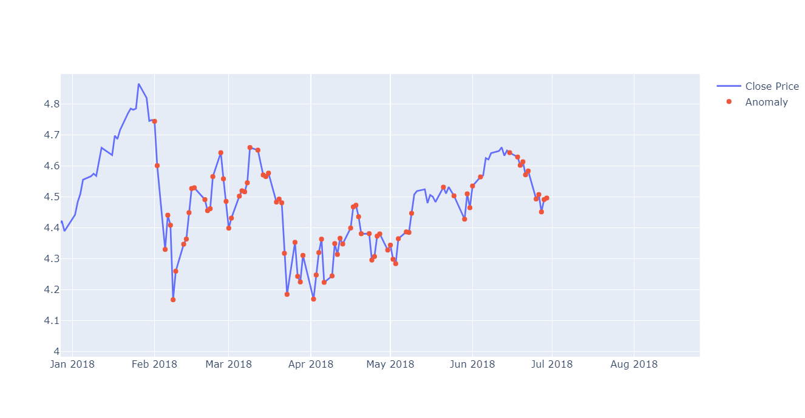

# Anomaly-Detection-on-Time-Series-Data
Used LSTM AutoEncoder to find anomalies in S&amp;P500 Daily Prices 1986 - 2018 dataset
Built an anomaly detection model using deep learning. Specifically designing and training an LSTM autoencoder using the Keras API with Tensorflow 2 as the backend to detect anomalies (sudden price changes) in the S&P 500 index also created interactive charts and plots using Plotly Python and Seaborn for data visualization and display our results in Jupyter notebooks.

